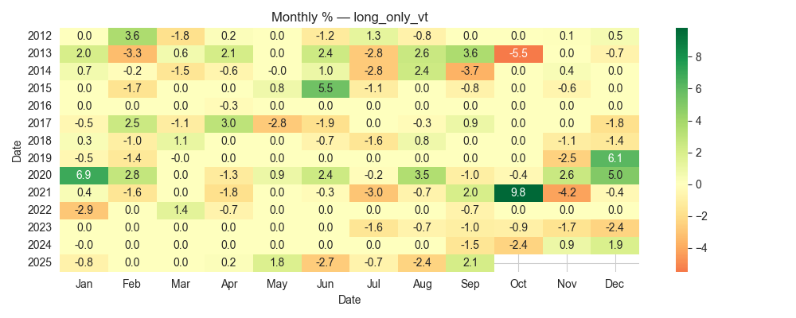
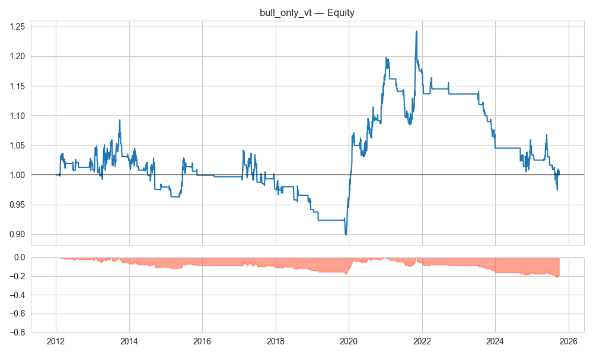
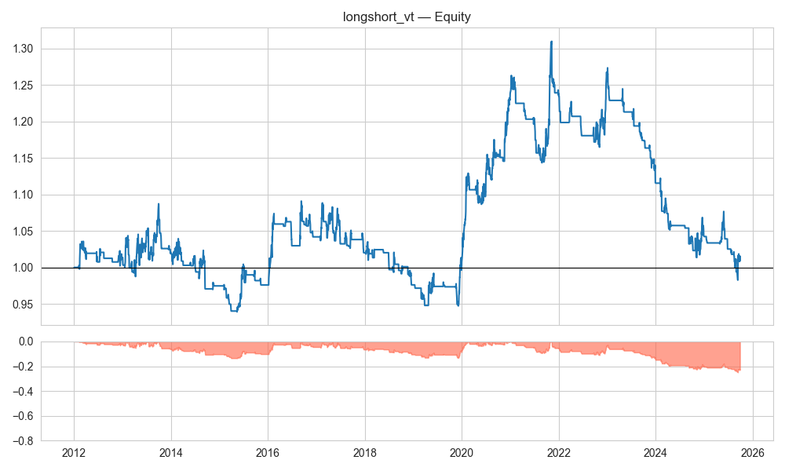
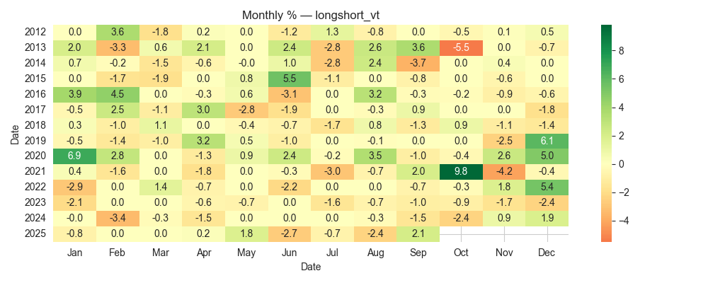

# TSLA EMA/RSI Backtest — A Negative Finding

**Research Question**  
Do “industry-standard” technical indicators — EMA crossovers plus RSI(14) filters — produce a tradable daily strategy on TSLA (2012–2025)?  

**Answer**  
No. After rigorous leak-free testing, realistic costs, and volatility targeting, the strategy fails out of sample.  
Performance is regime-specific, with positive results only during the 2019–2021 bull run, and negative/flat elsewhere.  

---

## Methodology (Rigor Checklist)

- **Universe & Horizon:** TSLA, daily bars (2012–2025)  
- **Execution:** Signals generated at close, executed next day open  
- **Costs:** 1 bps fees + 5 bps slippage per side  
- **Vol Targeting:** 10% annualized, leverage capped at 1.5×  
- **Splits:** Train ≤2018, Validation 2019–2021, Test ≥2022  
- **Sanity:** Unit test to prevent look-ahead; timezone alignment checked  

---

## Results

### Long-only (Vol Targeted)
  
*Concentrated gains in 2020–21 bull regime; flat to negative otherwise. Drawdowns persistent across other years.*

  
*Strong performance clustered in 2020–21; weak consistency elsewhere.*

---

### Bull-only (Vol Targeted)
  
*Similar profile to long-only; shorts add no value, and gains remain regime-specific.*

  
*Again, isolated green months in 2020–21; inconsistent before and after.*

---

### Long+Short (Vol Targeted)
  
*Adding shorts worsens performance: higher drawdowns, no persistent edge.*

  
*Chaotic distribution of returns; no robustness across regimes.*

---

## Key Metrics (with 10% Vol Targeting)

- **Train Sharpe:** ≈ –0.40  
- **Validation Sharpe:** ≈ +0.86  
- **Test Sharpe:** ≈ –1.21  
- **Conclusion:** Regime overfit — not a persistent edge  

CSV outputs:  
- [bt_long_only_vt.csv](artifacts/bt_long_only_vt.csv)  
- [bt_bull_only_vt.csv](artifacts/bt_bull_only_vt.csv)  
- [bt_longshort_vt.csv](artifacts/bt_longshort_vt.csv)  

---

## Conclusion

This is a **negative finding**: the EMA/RSI strategy cannot be considered robust or tradable on TSLA.  
Still, the project demonstrates a disciplined research workflow: proper data hygiene, leak-free backtest, realistic costs, walk-forward splits, and risk-aware metrics.

---

## Personal Note

This was my **first full backtest project** in my quant journey.  
I learned a lot — not just coding, but how to structure research like a professional quant: form a hypothesis, test it rigorously, and accept when the result is negative.  

I worked through this with the help of GPT-5 in an **active learning loop**: I wrote and debugged code cell by cell, asked questions, and tried to deeply understand each step.  

The outcome reminded me that **most ideas fail out of sample** — and that’s okay.  
It was fun, humbling, and motivating. I have a lot to learn, and I’m looking forward to building more rigorous, research-grade projects.  

---
